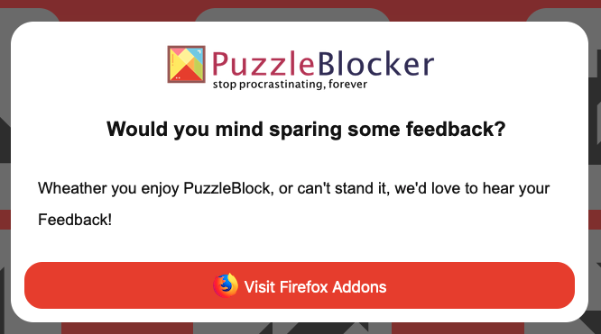
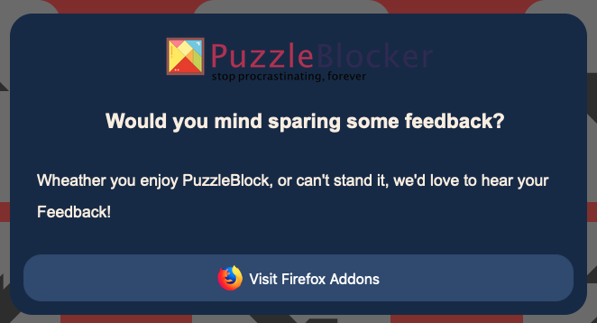

# webext-feedback-popup

This is a package to display a popup to ask the user for a feedback/rating on the browsers addon stores (e.g. Chrome Web Store, Firefox Addons).

Currently supported:

- Chrome (and any chromium/webkit platform)
- Firefox
- Edge
- Safari
- Opera

## Screenshots

;
;

## Installation

Use the npm to install:

```bash
npm install webext-feedback-popup
```

## Usage

You only have to initialize the modal using the constructor and a bunch of parameters, the rest is done for you.

It auto-detects the users browser and redirects them to the correct store.

```javascript
import WebExtFeedbackPopup from "webext-feedback-popup";

// On some compilers this can be 'url:./xyz.png'
import thisIsMyLogo from "./xyz.png";

const fbm = new WebExtFeedbackPopup({
  window: window,
  headline: "Would you mind sparing some feedback?",
  text: "We've put a lot of love into this project, would you mind sharing your thoughts and maybe a feedback on it?",
  installDate: new Date(2020, 1, 1, 10, 0, 0),
  frequency: 2,
  timeout: 20000,
  logo: thisIsMyLogo,
  storeLinks: {
    firefox: "https://addons.mozilla.org/de/firefox/addon/grammarly-1/",
    chrome:
      "https://chrome.google.com/webstore/detail/grammarly-for-chrome/kbfnbcaeplbcioakkpcpgfkobkghlhen",
    edge: "https://www.microsoft.com/en-us/p/grammarly-for-microsoft-edge/9p59wxtbhzzm?activetab=pivot:overviewtab",
    safari: "https://apps.apple.com/us/app/grammarly-for-safari/id1462114288",
    opera: "https://addons.opera.com/en/extensions/details/translator/",
  },
});
```

## Parameters

The constructor `WebExtFeedbackPopup` accepts an object with the following parameters:

| name          | type                   | description                                                                                                                                   | default                        | must?    |
| ------------- | ---------------------- | --------------------------------------------------------------------------------------------------------------------------------------------- | ------------------------------ | -------- |
| `window`      | `Window`               | MUST-SPECIFIY. usually you can just use "window" as this is the standard window object                                                        | `null`                         | required |
| `headline`    | `string`               | Headline to show in the top of the modal                                                                                                      | "I'm waiting for your rating!" | required |
| `text`        | `string`               | Accompanied text                                                                                                                              | ""                             | required |
| `installDate` | `Date`                 | Date when the extension was installed (tip: see below)                                                                                        | `null`                         | required |
| `storeLinks`  | `{browser: link, ...}` | links to your products on the stores i.e. `{firefox: "https://....", chrome: ...}`                                                            | {}                             | required |
| `logo`        | `string`               | URL to the logo (see Usage)                                                                                                                   | ""                             | optional |
| `frequency`   | `number`               | How often you want to display the modal in total. The modal get's displayed in `timeout` intervals (e.g. every 7 days for 5 times total)      | 1                              | optional |
| `timeout`     | `number`               | in ms. When the modal is to be displayed after installDate. (e.g. "In one week" = `7*24*60*60*1000`)                                          | 0                              | optional |
| `theme`       | `string`               | "dark" \| "light"                                                                                                                             | "light"                        | optional |
| `onOpen`      | `fn: void`             | function that get's executed when the modal is opened, this can be useful for things like adding body-padding, sending stats to a server etc. | do Nothing                     | optional |
| `onClose`     | `fn: void`             | function that get's executed when the modal is closed, this can be useful for things like removing body-padding, etc.                         | do Nothing                     | optional |

`onOpen` and `onClose` can be very useful if you have issues with the layout not being displayed correctly when the modal is open

### How to generate an installDate

I used a method like this to generate an installDate in my extension:

`background.js`

```javascript
// this uses: webext-options-sync (https://github.com/fregante/webext-options-sync)

async function showWelcomePage(details) {
  // Generate a new date from now
  const now = new Date(Date.now());

  if (details.reason === "install") {
    // Put the date into the optionsStorage
    await optionsStorage.set({ installDate: now.toString() });
    // Show the welcome page
    browser.tabs.create({
      active: true,
      url: "https://...",
    });
  }
}

// Let the function listen to the onInstalled Event
browser.runtime.onInstalled.addListener(showWelcomePage);
```

## Styling

To go beyond the themes – or out of pure vanity – you can inject your own styles like this:

```javascript
const fbm = new WebExtFeedbackPopup({...});
const styleString = `
    .fbm-modal {
        background-color: darkgreen;
        color: darkblue;
        width: 300px;
        height: 300px;
    }
`

fbm.setStyle(styleString)
```

**Warning**: Currently you cannot **overwrite** only certain classes, unless you are using `!important` in your own stylesheets.

_setStyle(...) requires you to replace **all stylings** for the modal. You can find the default styling to customize certain classes here: [DEFAULT_STYLES.md](/DEFAULT_STYLES.md)._

Classes are:

- `fbm-blur` : parent container that's darkening the background
- `fbm-modal` : modal-container
- `fbm-headline / fbm-text / fbm-button / fbm-logo` : self explanatory

## Support

Feel free to DM me on Twitter [@nikoisonfire](https://twitter.com/nikoisonfire)

## Contributing

As this is my first open source project, I'd love to hear some feedback and feel free to submit pull requests, bugs and issues – or feature requests. Your contribution is very much appreciated!

I'm always looking to grow as a developer, so be sure to go as harsh and constructive as nesseccary ;-)

## License

[MIT](https://choosealicense.com/licenses/mit/)
